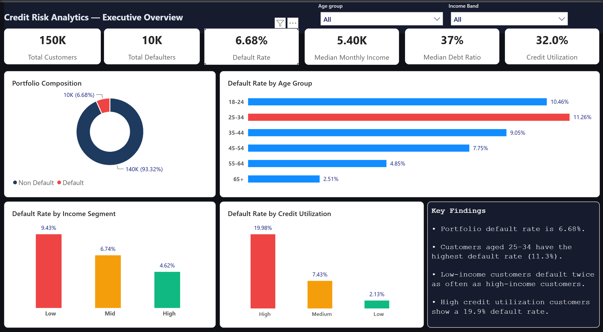
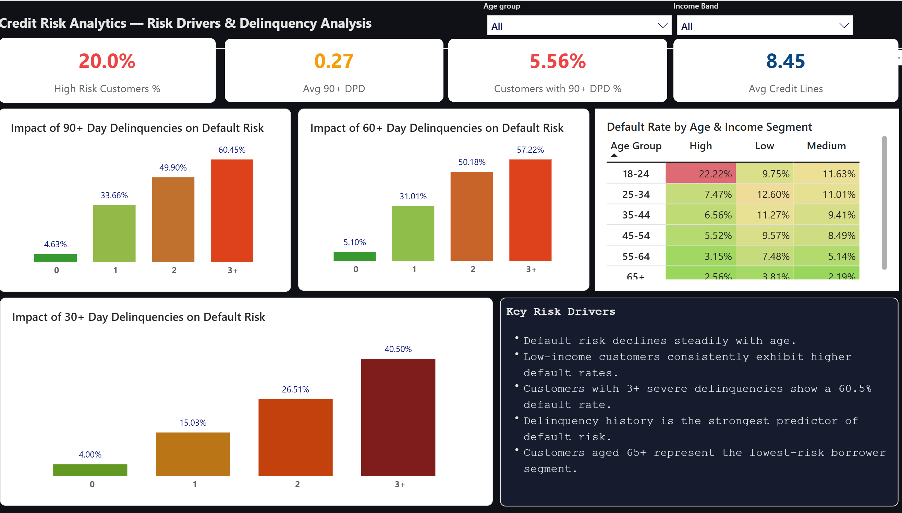
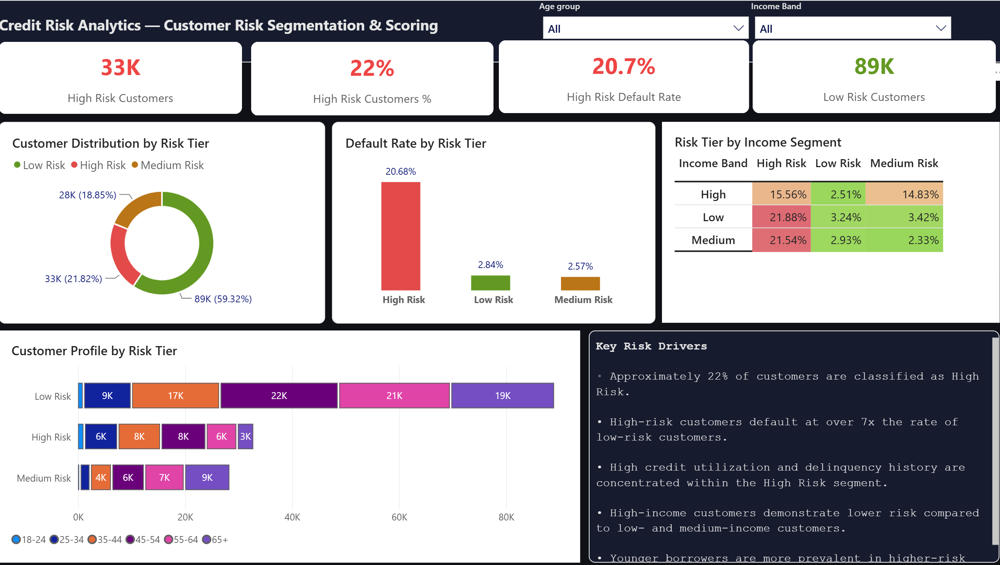

# Give Me Some Credit – Credit Risk Analysis

---

## Project Overview

This project performs an end-to-end credit risk analysis on a real-world loan dataset sourced from Kaggle. Using SQL for data exploration, Python for EDA and statistical analysis, and Power BI for interactive dashboarding, the project uncovers the key drivers behind loan defaults and translates raw data into actionable business insights.

The analysis follows a structured analytical workflow — from raw data ingestion and cleaning, through deep statistical testing, to a three-page executive dashboard designed for non-technical business stakeholders.

**Objective:** Identify which customer characteristics and financial behaviours are most strongly associated with loan default, and present those findings in a clear, decision-ready format.

**Business Context:** Financial institutions rely on credit risk models to make lending decisions. Understanding who is likely to default — and why — allows banks to set appropriate interest rates, limit exposure to high-risk segments, and intervene early with at-risk customers.

---

## Business Problem

Credit default has direct financial consequences for lenders — every unrecovered loan is a loss. Without a data-driven understanding of default risk, institutions either lend too conservatively (losing revenue) or too loosely (absorbing losses).

This analysis aims to answer:

- What is the overall default rate in this portfolio?
- Which customer segments default most frequently?
- Are delinquency history, credit utilization, and income statistically significant predictors of default?
- How can customers be segmented into actionable risk tiers?
- What early warning signals can be monitored to prevent defaults?

---

## Dataset

| Property | Detail |
|---|---|
| **Source** | [Kaggle – Give Me Some Credit](https://www.kaggle.com/c/GiveMeSomeCredit) |
| **Rows** | 150,000 borrower records |
| **Columns** | 11 features + 1 target |
| **Target Variable** | `SeriousDlqin2yrs` — 1 if the borrower experienced 90+ day delinquency within 2 years, 0 otherwise |
| **Default Rate** | 6.68% (class imbalance present) |

### Feature Descriptions

| Column | Description |
|---|---|
| `SeriousDlqin2yrs` | Target: 1 = defaulted, 0 = did not default |
| `RevolvingUtilizationOfUnsecuredLines` | Ratio of revolving credit used vs total limit |
| `age` | Customer age in years |
| `NumberOfTime30-59DaysPastDueNotWorse` | Times 30–59 days late in past 2 years |
| `DebtRatio` | Monthly debt payments divided by monthly income |
| `MonthlyIncome` | Gross monthly income (USD) — has ~20% missing values |
| `NumberOfOpenCreditLinesAndLoans` | Count of open credit accounts |
| `NumberOfTimes90DaysLate` | Times 90+ days late — strongest default predictor |
| `NumberRealEstateLoansOrLines` | Count of mortgage and real estate loans |
| `NumberOfTime60-89DaysPastDueNotWorse` | Times 60–89 days late in past 2 years |
| `NumberOfDependents` | Number of dependents (has ~2.6% missing values) |

---

## Project Objectives

- Understand the demographic and financial profile of the borrower population
- Identify which features are most strongly associated with loan default
- Analyse missing values, outliers, and data quality issues systematically
- Statistically validate observed patterns using hypothesis testing
- Segment customers into meaningful risk tiers (High / Medium / Low Risk)
- Build an interactive Power BI dashboard suitable for business stakeholders

---

## Tools & Technologies

| Tool / Library | Purpose |
|---|---|
| **MS SQL Server (SSMS)** | Data validation, exploration, aggregation, customer segmentation |
| **Python 3.13** | Data cleaning, EDA, statistical analysis, visualisation |
| **Power BI** | Interactive three-page executive dashboard |
| **Pandas** | Data manipulation and feature engineering |
| **NumPy** | Numerical operations and array handling |
| **Matplotlib & Seaborn** | Chart creation and statistical visualisation |
| **SciPy** | T-tests, chi-square tests, statistical significance testing |
| **Git & GitHub** | Version control and project hosting |

---

## Project Workflow

```
Raw Data (Kaggle CSV)
        │
        ▼
1. Data Understanding      ── Schema review, column profiling, data types
        │
        ▼
2. SQL Exploration          ── Portfolio overview, segmentation, delinquency analysis
        │
        ▼
3. Data Cleaning (Python)  ── Missing value treatment, outlier capping, feature engineering
        │
        ▼
4. EDA (Python)            ── 8 analytical charts, distribution analysis, pattern discovery
        │
        ▼
5. Statistical Analysis    ── T-tests, chi-square, correlation, IV, skewness analysis
        │
        ▼
6. Dashboard (Power BI)    ── 3-page interactive dashboard with filters
        │
        ▼
7. Business Insights       ── Findings, recommendations, risk flags
```

---

## SQL Analysis

The SQL analysis was performed in MS SQL Server Management Studio across **14 structured sections**, covering the full analytical journey from setup to executive summary.

[View SQL File](SQL/CreditRisk_SQL_Final.sql)

**Section 1 – Database & Table Setup**
Created the `CreditRiskDB` database and imported the 150,000-row CSV. Verified row count and previewed the first 5 records.

**Section 2 – Portfolio Overview**
Calculated total customers (150K), total defaulters (10K), total performing (140K), and the overall default rate (6.68%).

**Section 3 – Customer Profile**
Profiled the borrower base by average age, average monthly income, and income band distribution (Low / Middle / High).

**Section 4 – Age Risk Analysis**
Grouped customers into six age bands (18–24, 25–34, 35–44, 45–54, 55–64, 65+) and calculated default rate per band. The 25–34 group showed the highest default rate at 11.26%.

**Section 5 – Income Analysis**
Stratified customers into four income bands and compared default rates. Low-income customers defaulted at ~9.43% vs ~4.62% for high-income customers. Customers with missing income had a ~7.50% default rate — confirming missing income as a standalone risk signal.

**Section 6 – Delinquency Analysis**
Examined default rates across 30-day, 60-day, and 90-day late payment counts. Customers with 3+ incidents of 90-day delinquency showed a 60.45% default rate. Also segmented customers as "Never Late," "First Time Late," and "Repeat Offender."

**Section 7 – Debt Analysis**
Analysed default rates by debt ratio band (Low < 30%, Medium 30–60%, High 60%+). Higher debt burden consistently corresponded to higher default rates.

**Section 8 – Credit Utilization Analysis**
Customers using 70%+ of their revolving credit limit showed a 19.98% default rate, vs 2.13% for low-utilization customers.

**Section 9 – Dependents Analysis**
Examined default rate by family size. Customers with 4+ dependents had the highest stress indicators. Missing dependent data was flagged as an additional risk signal.

**Section 10 – Portfolio Quality Buckets**
Classified the entire portfolio into four health categories: Good Standing, Watch, Stressed, and Defaulted — providing a traffic-light view of portfolio health.

**Section 11 – Combined Risk Analysis**
Identified "Double High Risk" customers (high utilization AND high debt ratio simultaneously) — the most dangerous segment with the highest observed default rate.

**Section 12 – Top Risky Customers**
Queried the top 20 riskiest individual customers ranked by 90-day delinquency count and debt ratio — the type of list that would trigger collection calls in a real institution.

**Section 13 – Window Functions**
Used `RANK()`, `NTILE()`, and running `SUM()` over window partitions to rank customers by income, split into income deciles, and compute cumulative defaults by age group.

**Section 14 – Executive Summary**
A single query returning the complete portfolio story: total customers, defaulters, performing, default rate, average income, average age, average debt ratio, average credit utilization, and missing income count.

---

## Python Analysis

[View EDA and Stistical Analysis Notebook](notebooks/)

### Data Cleaning

- Removed 1 invalid record where `age = 0`
- Imputed `MonthlyIncome` NULLs with the median value (5,400)
- Imputed `NumberOfDependents` NULLs with 0
- Capped outliers at the 99th percentile for `RevolvingUtilizationOfUnsecuredLines`, `DebtRatio`, and `MonthlyIncome` (Winsorisation — rows retained, not removed)
- Final cleaned dataset: 149,999 rows

### Feature Engineering

- `TotalDelinquencies`: sum of all three late payment columns
- `AgeBand`: six age group bins (18–24 through 65+)
- `IncomeBand`: Low / Mid / High income categories
- `UtilizationBand`: Low / Medium / High revolving utilization
- `DebtBand`: Low / Medium / High debt ratio
- `RiskBand`: customer-level risk tier (High / Medium / Low) based on utilization and delinquency thresholds

### EDA Charts (8 Charts)

| Chart | What It Shows |
|---|---|
| Chart 1 | Default overview — portfolio split between defaulters and non-defaulters |
| Chart 2 | Default rate by age group — younger borrowers default more |
| Chart 3 | Credit utilization distribution by default status |
| Chart 4 | Monthly income distribution — defaulters vs non-defaulters |
| Chart 5 | Delinquency history patterns — 30, 60, 90-day late payments |
| Chart 6 | Missing data visualisation — which columns have nulls and how many |
| Chart 7 | Correlation heatmap — what drives default most |
| Chart 8 | Risk segmentation summary — High / Medium / Low risk bands |

---

## Statistical Analysis

All statistical tests were performed in Python using `SciPy`, with results interpreted at the standard α = 0.05 significance level.

### Descriptive Statistics

| Metric | Value |
|---|---|
| Average Age | 52 years |
| Median Monthly Income | $5,400 |
| Mean Monthly Income | $6,142 (skewed upward by high earners) |
| Average Credit Utilization | 32.0% |
| Average Debt Ratio | 35% (post outlier capping) |
| Average Total Delinquencies | 0.93 per customer |

### T-Test (Independent Samples)

Tested whether defaulters and non-defaulters differ significantly on key numeric features.

| Feature | Non-Default Avg | Default Avg | T-Statistic | p-Value | Result |
|---|---|---|---|---|---|
| Monthly Income | $6,193 | $5,429 | 19.31 | < 0.0001 | ✅ Significant |
| Age | 52.75 yrs | 45.93 yrs | 44.99 | < 0.0001 | ✅ Significant |
| Credit Utilization | 0.29 | 0.69 | −113.32 | < 0.0001 | ✅ Significant |

All three features showed statistically significant differences between defaulters and non-defaulters.

### Chi-Square Test

Tested whether categorical groupings (age band, income band) are statistically associated with default status.

- **Age Group vs Default**: χ² statistically significant — age group is not independent of default (p < 0.05)
- **Income Band vs Default**: χ² statistically significant — income group is not independent of default (p < 0.05)

### Correlation Analysis

Pearson correlation with the target variable `SeriousDlqin2yrs`:

- `NumberOfTimes90DaysLate` — strongest positive correlation with default
- `RevolvingUtilizationOfUnsecuredLines` — second strongest positive correlation
- `age` — moderate negative correlation (older customers default less)
- `MonthlyIncome` — weak negative correlation

### Information Value (IV)

Ranked features by their predictive power for default:

- **Delinquency variables** — very strong predictors (IV > 0.3)
- **Credit Utilization** — strong predictor
- **Age** — moderate predictor
- **Monthly Income** — moderate predictor
- **Number of Dependents** — weak predictor

### Skewness Analysis

- `MonthlyIncome`: heavily right-skewed — a small number of very high earners pull the mean above the median
- `DebtRatio`: extremely right-skewed — extreme outliers required 99th percentile capping
- `TotalDelinquencies`: right-skewed — most customers have zero delinquencies
- `age`: approximately symmetric

---

## Power BI Dashboard

The dashboard spans three pages, each with age group and income band slicers for dynamic filtering.

### Page 1 — Executive Overview

**KPI Cards:** Total Customers (150K), Total Defaulters (10K), Default Rate (6.68%), Median Monthly Income ($5.40K), Median Debt Ratio (37%), Credit Utilization (32.0%)

**Visuals:**
- Portfolio composition donut chart — 93.32% performing vs 6.68% defaulted
- Default rate by age group bar chart
- Default rate by income segment bar chart
- Default rate by credit utilization bar chart
- Key Findings summary panel

### Page 2 — Risk Drivers & Delinquency Analysis

**KPI Cards:** High Risk Customers % (20%), Avg 90+ DPD (0.27), Customers with 90+ DPD % (5.56%), Avg Credit Lines (8.45)

**Visuals:**
- Impact of 90+ day delinquencies on default risk (0 incidents: 4.63% → 3+ incidents: 60.45%)
- Impact of 60+ day delinquencies on default risk (0: 5.10% → 3+: 57.22%)
- Impact of 30+ day delinquencies on default risk (0: 4.00% → 3+: 40.50%)
- Default rate by age group × income segment cross-table (heat-coloured)
- Key Risk Drivers summary panel

### Page 3 — Customer Risk Segmentation & Scoring

**KPI Cards:** High Risk Customers (33K), High Risk % (22%), High Risk Default Rate (20.7%), Low Risk Customers (89K)

**Visuals:**
- Customer distribution by risk tier donut chart — 59.32% Low, 21.82% High, 18.85% Medium
- Default rate by risk tier bar chart — High Risk: 20.68% vs Low Risk: 2.84%
- Risk tier by income segment cross-table
- Customer profile by risk tier stacked age bar chart
- Key Risk Drivers summary panel

### Interactive Filters
- Age Group slicer (All, 18–24, 25–34, 35–44, 45–54, 55–64, 65+)
- Income Band slicer (All, Low, Mid, High)

---

## Key Findings

**Portfolio Health**
- Portfolio default rate is 6.68% across 150,000 customers, with 10,000 defaulters and 140,000 performing accounts. The dataset is heavily class-imbalanced.

**Age**
- Customers aged 25–34 have the highest default rate (11.26%), followed by 18–24 (10.46%). Default risk declines steadily with age. Customers aged 65+ show the lowest default rate (2.51%).

**Income**
- Low-income customers default at nearly twice the rate of high-income customers (9.43% vs 4.62%). Customers with missing income records default at 7.50%, making missing income itself a risk signal.

**Delinquency History**
- Delinquency history is the single strongest predictor of default. Customers with 3+ incidents of 90-day delinquency default at 60.45%. Even 1 incident of 30-day delinquency more than triples the default rate compared to never-late customers.

**Credit Utilization**
- Customers using more than 70% of their revolving credit limit default at 19.98% — nearly 10× the rate of low-utilization customers (2.13%). T-test confirms this difference is statistically significant (p < 0.0001).

**Risk Segmentation**
- 22% of customers (33K) are classified as High Risk, with a 20.68% default rate. High-risk customers default at over 7× the rate of low-risk customers. High credit utilization and delinquency history are concentrated in this segment.

**Combined Risk**
- Customers with both high credit utilization (70%+) and high debt ratio (60%+) represent a "Double High Risk" segment with the highest observed default rates in the portfolio.

---

## Business Recommendations

**Risk Monitoring & Early Intervention**
- Implement real-time monitoring for customers crossing the 30-day delinquency threshold. The data shows even a single 30-day late payment more than triples default risk — early outreach at this stage is far more cost-effective than collections.
- Flag customers with 90-day delinquency as requiring immediate account review. A 60.45% default rate makes this a near-certain loss without intervention.

**Lending Policy Improvements**
- Apply stricter credit assessment for applicants aged 25–34 — the highest-risk age cohort. Consider requiring additional income verification or collateral for this segment.
- Use credit utilization thresholds as a lending guardrail. Applicants already using 70%+ of existing revolving credit represent materially elevated risk and should face closer scrutiny.
- Treat missing income data as an active risk flag, not a neutral data quality issue. Applicants with missing income show a 7.50% default rate — significantly above the portfolio average.

**Customer Segmentation**
- Segment the 33K High Risk customers for priority engagement, debt restructuring offers, or proactive credit limit reviews.
- Protect and grow the 89K Low Risk segment. These customers (59% of the portfolio) present significant cross-sell and upsell opportunities with minimal default exposure.
- Design differentiated product offerings by income band — high-income customers (4.62% default rate) can be offered premium credit products with lower pricing.

**Areas for Further Investigation**
- Explore interaction effects between age and income — the cross-table in the dashboard suggests that high-income young customers behave very differently from low-income young customers.
- Investigate the "unknown income" cohort more deeply — this group's risk profile may warrant a dedicated sub-analysis.
- Analyse the relationship between number of open credit lines and default to assess credit concentration risk.

---

## Dashboard Preview

### Page 1 — Executive Overview


### Page 2 — Risk Drivers & Delinquency Analysis


### Page 3 — Customer Risk Segmentation & Scoring


---

## Challenges Faced

**Missing Data**
`MonthlyIncome` had approximately 20% missing values and `NumberOfDependents` had ~2.6% missing. Simple deletion would have lost too many rows and introduced bias. Missing values were imputed using median income and zero dependents respectively, with the missing income flag retained as a risk signal in SQL analysis.

**Outliers**
`DebtRatio` had extreme values exceeding 4,000 (e.g., retirees with zero income). `RevolvingUtilizationOfUnsecuredLines` had values above 1.0 (which is mathematically invalid). These were handled via 99th percentile Winsorisation — capping rather than removing — to preserve all 150K records while eliminating distortion.

**Class Imbalance**
The dataset is heavily imbalanced: only 6.68% of customers defaulted. This means standard accuracy metrics are misleading (a model that predicts "no default" for everyone achieves 93.32% accuracy while providing zero business value). The analysis focused on default rates by segment rather than raw counts to account for this imbalance. Predictive modelling (the natural next step) would require resampling techniques such as SMOTE.

**Data Quality Issues**
One record contained `age = 0`, which was removed as invalid. Several customers had `RevolvingUtilizationOfUnsecuredLines` values greater than 1.0, which was flagged and filtered in SQL analysis before being capped in Python. Extreme `DebtRatio` values required careful handling to avoid distorting income and debt analysis.

---

## Project Structure

```
credit-risk-analysis/
│
├── data/
│   ├── cs-training.csv              # Raw dataset (Kaggle)
│   └── cleaned_data.xlsx            # Cleaned dataset used in Power BI
│
├── sql/
│   └── CreditRisk_SQL_Final.sql     # All 14 SQL sections (SSMS)
│
├── notebooks/
│   ├── CreditRisk_EDA.ipynb         # Exploratory Data Analysis (8 charts)
│   └── CreditRisk_Statistical_Analysis.ipynb  # Statistical tests & validation
│
├── powerbi/
│   └── CreditRisk_Dashboard.pbix    # Three-page Power BI dashboard
│
├── images/
│   ├── page1_executive.png          # Dashboard screenshot – Executive Overview
│   ├── page2_delinquency.png        # Dashboard screenshot – Risk Drivers
│   └── page3_segmentation.png       # Dashboard screenshot – Risk Segmentation
│
└── README.md
```

---

## Skills Demonstrated

| Skill | Detail |
|---|---|
| **SQL Querying** | CTEs, window functions (RANK, NTILE, running SUM), CASE segmentation, multi-table aggregations across 14 analytical sections |
| **Data Cleaning** | Median imputation, 99th percentile Winsorisation, invalid record filtering, null handling strategy |
| **Exploratory Data Analysis** | 8 structured EDA charts covering distribution, default patterns, delinquency, income, utilization, and risk segmentation |
| **Statistical Analysis** | Independent samples T-test, Chi-Square test, Pearson correlation, Information Value ranking, skewness and kurtosis analysis |
| **Data Visualisation** | Matplotlib and Seaborn charts with consistent styling, annotation, and insight callouts |
| **Power BI Dashboard Development** | Three-page interactive dashboard with KPI cards, bar charts, donut charts, cross-tables, and dynamic slicers |
| **Business Storytelling** | Translating statistical findings into plain-English key findings, risk drivers panels, and actionable recommendations |
| **Insight Generation** | Identifying non-obvious signals (missing income as a risk flag, combined utilization + debt ratio risk, age × income interaction effects) |

---

## Author

**Name:** [Your Name]

**LinkedIn:** [linkedin.com/in/yourprofile](https://linkedin.com/in/yourprofile)

**GitHub:** [github.com/yourusername](https://github.com/yourusername)
